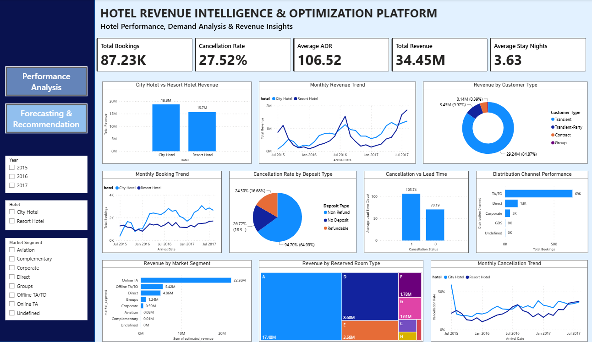
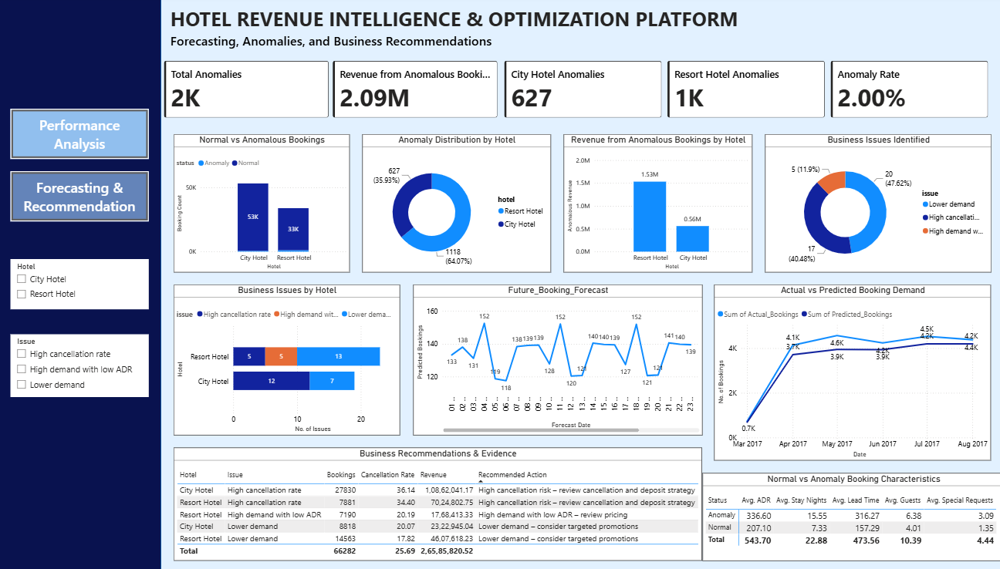

# Hotel Demand & Revenue Intelligence Dashboard

## Overview

The **Hotel Demand & Revenue Intelligence Dashboard** is an end-to-end data analytics and forecasting project designed to analyze hotel booking patterns, cancellations, customer behavior, anomalies, and future booking demand.

The project combines **Python, SQL, Machine Learning, and Power BI** to transform historical hotel booking data into actionable business insights. The analysis includes anomaly detection using Isolation Forest, demand forecasting using multiple forecasting approaches, and interactive Power BI dashboards for business decision-making.

---

## Problem Statement

Hotels generate large volumes of booking data, but converting this data into meaningful insights for operational and revenue decisions can be challenging.

Key business questions addressed in this project include:

- How do booking patterns differ between City Hotels and Resort Hotels?
- What trends exist in booking demand, cancellations, and customer behavior?
- Are there unusual booking patterns that require further investigation?
- How accurately can historical booking demand be predicted?
- How can future demand forecasts support staffing, pricing, inventory, and marketing decisions?

This project addresses these challenges by developing an integrated analytics and forecasting solution that combines historical analysis, anomaly detection, demand prediction, and business intelligence.

---

# Project Objectives

- Analyze hotel booking patterns and demand trends.
- Identify cancellation and customer behavior patterns.
- Analyze hotel performance and key business metrics.
- Detect unusual booking patterns using anomaly detection.
- Create daily booking demand time-series data.
- Build forecasting models to predict future booking demand.
- Evaluate forecasting model performance.
- Generate future hotel booking forecasts.
- Translate analytical insights into actionable business recommendations.
- Develop an interactive Power BI dashboard for decision-making.

---

# Dataset

The project analyzes approximately **87,230 hotel booking records** across two hotel categories:

- City Hotel
- Resort Hotel

The dataset contains booking-related information such as:

- Hotel type
- Reservation status
- Booking dates
- Lead time
- Length of stay
- Cancellation status
- Customer type
- Market segment
- Distribution channel
- Daily booking demand

---

# Tech Stack

| Technology / Tool | Usage |
|---|---|
| Python | Data cleaning, analysis, anomaly detection, and forecasting |
| Google Colab | Python-based project development and analysis environment |
| Pandas | Data cleaning, manipulation, and transformation |
| NumPy | Numerical analysis and calculations |
| Matplotlib | Exploratory data visualization and analysis |
| SQL | Data querying and business analysis |
| Isolation Forest | Detection of anomalous booking patterns |
| 7-Day Moving Average | Baseline demand forecasting |
| SARIMA | Seasonal time-series forecasting |
| Random Forest | Machine Learning-based demand prediction |
| Scikit-learn | Machine Learning and model implementation |
| Statsmodels | Time-series forecasting |
| Power BI | Interactive dashboard development |
| Power Query | Data transformation and preparation |
| DAX | KPI calculations and custom measures |

---

# Project Workflow

## 1. Data Understanding & Preparation

The hotel booking dataset was examined to understand its structure, data types, and business variables.

The preparation process included:

- Reviewing dataset structure and relevant columns.
- Handling missing and inconsistent values.
- Converting date-related fields into appropriate formats.
- Preparing cleaned datasets for analysis.
- Creating datasets suitable for visualization and forecasting.

---

## 2. Exploratory Data Analysis

Exploratory Data Analysis (EDA) was performed to understand historical hotel booking behavior and identify important trends.

The analysis focused on:

- Booking volume trends.
- Hotel type performance.
- Cancellation patterns.
- Lead-time behavior.
- Customer booking behavior.
- Market segment performance.
- Distribution channel patterns.
- Time-based booking trends.

The findings from this stage were used to guide further analysis and dashboard development.

---

## 3. SQL Business Analysis

SQL was used to perform structured business analysis and answer key questions related to hotel performance.

The SQL analysis focused on:

- Booking trends.
- Hotel-level performance.
- Customer segments.
- Cancellation behavior.
- Time-based demand patterns.
- Operational and business performance indicators.

---

## 4. Anomaly Detection using Isolation Forest

The **Isolation Forest algorithm** was applied to identify unusual booking patterns within the dataset.

### Result

- **1,745 anomalous booking records were identified.**

These anomalies were analyzed separately from normal booking records to highlight unusual patterns and improve understanding of booking behavior.

---

## 5. Daily Booking Demand Creation

Booking-level records were aggregated into daily booking demand.

Separate time-series datasets were created for:

- City Hotel
- Resort Hotel

This transformation converted individual booking records into daily demand data suitable for forecasting.

---

## 6. Train-Test Split

The daily booking demand datasets were divided into training and testing periods for forecasting model evaluation.

### Forecasting Data Split

- **Training Period:** 634 days
- **Testing Period:** 159 days

The forecasting models generated predictions for both hotel types during the testing period.

### Forecast Test Period

**26 March 2017 – 31 August 2017**

---

## 7. Demand Forecasting

Three forecasting approaches were implemented to predict daily hotel booking demand.

### 7-Day Moving Average

A rolling average of booking demand from the previous seven days was used as a baseline forecasting approach.

### SARIMA

SARIMA was used to capture time-series trends and seasonal patterns in hotel booking demand.

### Random Forest

A Random Forest machine learning model was used to predict booking demand based on historical demand patterns.

---

## 8. Model Evaluation

The forecasting models were evaluated using multiple performance metrics:

- **MAE (Mean Absolute Error)**
- **RMSE (Root Mean Squared Error)**
- **MAPE (Mean Absolute Percentage Error)**
- **Forecast Bias**

### Best Model Results

| Hotel Type | Best Model | MAE | RMSE |
|---|---|---:|---:|
| City Hotel | SARIMA | **16.37** | 21.05 |
| Resort Hotel | Random Forest | **11.07** | **15.38** |

### Key Findings

- **SARIMA achieved the lowest MAE for City Hotel at 16.37.**
- **Random Forest achieved the strongest forecasting performance for Resort Hotel with an MAE of 11.07 and RMSE of 15.38.**

Individual model comparisons were performed during the analysis phase and were not included as visuals on the final business dashboard.

---

## 9. Actual vs Predicted Demand Analysis

The selected prediction outputs were compared with actual booking demand during the testing period.

The analysis included:

- Actual daily booking demand.
- Predicted daily booking demand.
- Separate demand analysis for City Hotel and Resort Hotel.

This analysis demonstrates how closely the final forecasting approach captured historical booking demand patterns.

---

## 10. 30-Day Future Booking Demand Forecast

A future booking demand forecast was generated for the 30-day period immediately following the available historical dataset.

### Forecast Period

**1 September 2017 – 30 September 2017**

Separate forecasts were generated for:

- City Hotel
- Resort Hotel

### Forecast Results

#### City Hotel

- Average predicted demand: **79.54 bookings per day**
- Minimum predicted demand: **70.56 bookings**
- Maximum predicted demand: **91.43 bookings**
- Total predicted bookings: **2,386.23**

#### Resort Hotel

- Average predicted demand: **54.80 bookings per day**
- Minimum predicted demand: **46.94 bookings**
- Maximum predicted demand: **62.99 bookings**
- Total predicted bookings: **1,643.86**

---

## 11. Business Recommendations & Decision Support

Insights from exploratory analysis, anomaly detection, and demand forecasting were translated into actionable business recommendations.

The recommendations focused on:

### Demand-Based Staffing

Adjust staffing levels based on predicted booking demand to improve workforce utilization and operational efficiency.

### Dynamic Pricing

Use predicted demand patterns to support pricing decisions:

- Increase pricing during expected high-demand periods.
- Introduce promotional offers during predicted low-demand periods.

### Inventory & Room Planning

Use future demand forecasts to plan:

- Room availability.
- Housekeeping schedules.
- Hotel supplies.
- Operational resources.

### Targeted Marketing

Launch targeted promotional campaigns during predicted low-demand periods to improve occupancy.

### Anomaly Monitoring

Monitor anomalous booking patterns to identify unusual customer behavior or potential operational issues.

These recommendations connect analytical findings with practical hotel management decisions.

---

## 12. Power BI Dashboard Development

The processed analytical and forecasting datasets were integrated into Power BI to develop an interactive two-page dashboard.

### Page 1: Hotel Performance & Booking Analytics

The first dashboard page focuses on historical booking analysis and includes insights related to:

- Booking performance.
- Hotel type analysis.
- Booking trends.
- Cancellation patterns.
- Customer behavior.
- Lead-time analysis.
- Anomaly insights.
- Key business metrics.

### Page 2: Demand Forecasting & Business Recommendations

The second dashboard page focuses on:

- Actual vs Predicted Daily Booking Demand.
- 30-Day Future Booking Demand Forecast.
- Hotel-level demand analysis.
- Interactive hotel filtering.
- Forecast-driven business recommendations.

---

# Dashboard Preview

## Page 1: Hotel Performance & Booking Analytics

## Page 2: Demand Forecasting & Business Recommendations

---

# Key Results & Insights

## Dataset & Anomaly Analysis

- **87,230 hotel booking records were analyzed.**
- **1,745 anomalous booking records were identified using Isolation Forest.**

## Forecasting Performance

- Daily booking demand was forecasted separately for **City Hotel and Resort Hotel**.
- The forecasting models were tested over **159 days**.
- **SARIMA achieved the lowest MAE of 16.37 for City Hotel.**
- **Random Forest achieved the best performance for Resort Hotel with an MAE of 11.07 and RMSE of 15.38.**

## Future Demand Forecast

### City Hotel

The 30-day forecast indicates:

- **Average daily predicted demand: 79.54 bookings**
- **Demand range: 70.56 to 91.43 bookings per day**
- **Total predicted demand: 2,386.23 bookings**

### Resort Hotel

The 30-day forecast indicates:

- **Average daily predicted demand: 54.80 bookings**
- **Demand range: 46.94 to 62.99 bookings per day**
- **Total predicted demand: 1,643.86 bookings**

### Comparative Insight

The forecast indicates that **City Hotel is expected to experience higher booking demand than Resort Hotel throughout the 30-day forecast period**.

---

# Key Skills Demonstrated

- Data Cleaning & Preprocessing
- Exploratory Data Analysis (EDA)
- Data Visualization using Matplotlib
- Python Programming
- Pandas & NumPy
- SQL Business Analysis
- Isolation Forest
- Anomaly Detection
- Time-Series Analysis
- 7-Day Moving Average Forecasting
- SARIMA Forecasting
- Random Forest
- Machine Learning
- Demand Forecasting
- Model Evaluation
- MAE, RMSE, MAPE & Forecast Bias
- Power BI Dashboard Development
- Power Query
- DAX
- Business Intelligence
- Business Insights & Recommendations

---

## Author

**Pranjali Sus**

Aspiring Data Analyst | Business Intelligence | Power BI | Tableau | SQL | Python

---

## ⭐ If you found this project useful, consider giving this repository a star!
